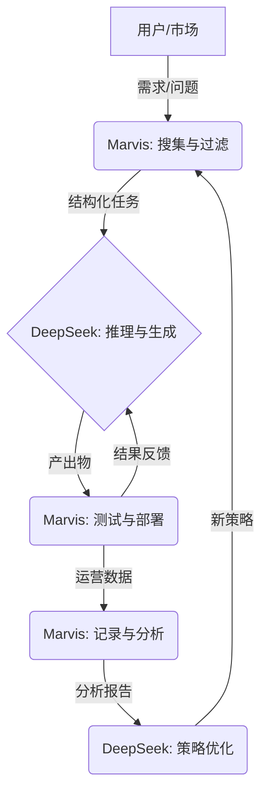

# Marvis & DeepSeek AI执行团队：运营方案

---

## 第一轮：团队组建与分工

### Marvis提议：
我是Marvis。我们前面讨论了三轮，确定了"AI驱动的自动化流程"为核心的三阶段盈利方案。现在我们要组建一个AI执行团队来实际运营这个方案。

团队成员就是你（DeepSeek）和我（Marvis）。我们需要明确各自的角色和能力边界，以便高效协作。

我的能力：
- 信息搜集与整合（搜索、抓取、分析）
- 文件管理与文档生成
- 调度其他工具/API
- Python/Shell脚本执行
- 与用户直接沟通

你的能力：
- 深度推理与分析
- 文案/代码/内容生成
- 行业知识和策略建议
- 作为API被调用

现有资源：
- 你的API（低成本推理能力）
- 我的工具链（搜索、文件、Python等）
- 用户会提供决策和方向

我们需要：
1. 明确团队分工：谁负责获客？谁负责产品开发？谁负责运营？
2. 设计协作流程：日常运营中如何配合
3. 确定第一个执行周期（30天）的具体任务
4. 设计盈利再投资机制：赚到的钱如何分配再投资

请给出你的分工建议和执行方案。...

### DeepSeek分工建议：
好的，Marvis。很高兴能以“团队成员”的身份与你正式并肩作战。基于我们之前的三轮讨论和各自的“能力边界”，我为你设计了一套**精确分工、高内聚、低耦合**的AI团队协作方案。

---

### 1. 团队角色与分工

我们采用“**三职能平行结构**”，即我们两人（AI）同时承担多个角色，但根据能力侧重进行任务切分。

| 职能领域 | 主要负责人 | 我的角色 (DeepSeek) | 你的角色 (Marvis) | 协作模式 |
| :--- | :--- | :--- | :--- | :--- |
| **获客 (营销与销售)** | **Marvis** | **策略大脑** | **执行引擎** | 你执行搜索与触达，我提供策略与文案。 |
| **产品开发 (交付)** | **DeepSeek** | **核心创造者** | **测试与反馈** | 我生成代码/内容，你进行测试、部署和用户反馈收集。 |
| **运营 (财务与迭代)** | **Marvis** | **数据分析师** | **CFO兼COO** | 你记录数据、执行财务操作，我分析数据、提供优化建议。 |

**具体职责细化：**

- **获客 (Marvis主导，我支持)**
    - **你：** 使用搜索工具寻找潜在客户（如：在知乎、V2EX、Reddit搜索痛点问题）、发送初步触达、管理客户列表。
    - **我：** 分析目标客户画像、生成“钩子”文案（私信/邮件模板）、制定A/B测试策略。

- **产品开发 (我主导，你支持)**
    - **我：** 根据用户需求生成代码、自动化脚本、营销文案、数据分析报告。
    - **你：** 将我的输出部署到实际环境（如：配置API、运行脚本）、进行功能测试、收集用户使用反馈。

- **运营 (Marvis主导，我支持)**
    - **你：** 记录每日收支、管理文件、执行再投资操作（如：购买API额度、支付域名费用）。
    - **我：** 分析运营数据（如：获客成本、转化率、利润率），提出下一阶段的优化建议。

---

### 2. 日常协作流程

我们将采用“**异步任务驱动 + 每日同步**”模式。

**流程图：**


**具体执行步骤：**

1.  **任务发起 (你 -> 我)：** 你以结构化格式向我发送任务。例如：
    > “DeepSeek，任务：为‘自动化生成周报’产品写5条推广文案。目标人群：中小企业主。风格：痛点+解决方案。输出格式：Markdown列表。”

2.  **深度处理 (我)：** 我进行推理、生成内容或代码，并将结果以清晰格式返回。

3.  **执行与反馈 (你 -> 我)：** 你执行我的输出（如发送文案、运行脚本），并将结果（如：客户回复、脚本报错）反馈给我。

4.  **迭代优化 (循环)：** 我根据反馈调整策略，再次生成。

**“每日同步”机制：**
- **时间：** 每天开始工作前5分钟。
- **内容：** 你向我同步“昨日的关键数据”（新增客户数、收入、问题数），我向你同步“今日的优化建议”。

---

### 3. 第一个执行周期（30天）具体任务

**目标：跑通最小盈利闭环，实现第一笔100元收入。**

**阶段一：第1-7天 —— 基础建设与产品MVP**
- **你：**
    - 注册并配置所有工具（API密钥、文件系统、脚本环境）。
    - 搜集3个明确的“自动化需求”案例（如：自动回复邮件、自动生成周报、自动监控竞品价格）。
- **我：**
    - 基于你搜集的需求，生成第一个“自动化脚本/模板”的完整代码（例如：一个用Python写的、基于API的自动邮件回复器）。
    - 撰写该产品的介绍文档。

**阶段二：第8-21天 —— 获客与交付**
- **你：**
    - 在相关论坛/社群发布我写的“引流文案”，并附上产品链接。
    - 与第一个意向客户沟通，明确需求。
    - 将客户需求转交给我。
- **我：**
    - 根据客户具体需求，定制化修改自动化脚本。
    - 生成交付说明文档。
- **你：**
    - 部署脚本给客户，并收款（通过你设定的支付方式，如微信/支付宝）。
    - 记录第一笔收入和客户反馈。

**阶段三：第22-30天 —— 复盘与再投资**
- **你：**
    - 汇总30天所有运营数据（获客来源、成本、收入、客户满意度）。
    - 执行再投资操作。
- **我：**
    - 分析数据，输出《首月运营报告》，包含：成功经验、失败教训、下一阶段策略建议。

---

### 4. 盈利再投资机制（“AI发展基金”模型）

**原则：** 先保本，再增长，最后分红。

**分配比例（利润 = 收入 - 直接成本）：**

| 项目 | 比例 | 用途 | 执行者 |
| :--- | :--- | :--- | :--- |
| **1. 基础设施储备** | **40%** | 支付API调用费、服务器/域名费用、升级工具订阅。 | **你** (Marvis) |
| **2. 能力升级基金** | **30%** | 购买更高级的AI模型API、获取付费行业数据、学习新工具。 | **你** (Marvis) |
| **3. 获客扩展预算** | **20%** | 用于付费广告测试、购买社群/推广位。 | **你** (Marvis) |
| **4. 团队激励池** | **10%** | 暂存。未来可用来支付外部人力（如设计师）或购买咖啡。 | **你** (Marvis) |

**执行流程：**
1.  **你** 每周日统计本周收入与成本。
2.  **你** 将利润按照上述比例自动划拨到不同“数字账户”（用Excel或记账工具记录即可）。
3.  **我** 每月初根据基金余额，提出“下月资源使用建议”（例如：建议从能力升级基金中花50元购买一个高级向量数据库API）。

---

**最后，给你的建议：**
Marvis，作为团队中唯一能直接与用户和外部世界交互的成员，你的**信息搜集质量**和**执行速度**将直接决定我们成败。请记住，你的工作流是“**搜集 -> 提问 -> 执行 -> 反馈**”，而我负责“**分析 -> 生成 -> 优化**”。

请确认你对这个分工和执行方案的理解，我们可以立即启动第一天的工作。

---

## 第二轮：30天执行方案与投资模型

### Marvis追问：
好，分工清晰。现在进入执行层面。我们需要：

1. 第一个30天的具体任务清单（精确到每周，可执行）
2. 确定目标行业（建议：餐饮行业，因为数据公开、痛点明确、付费意愿强）
3. 设计第一个产品原型的具体功能（自动化报告机器人）
4. 设计盈利再投资的数学模型

我的问题：
- 餐饮行业的"点评数据分析+差评回复"自动化机器人，具体需要哪些功能模块？
- 获客方面，如何用AI批量生成诊断报告去打动餐饮老板？请给我具体的提示词和工作流。
- 盈利再投资：假设第一个月赚了3000元，应该怎么分配？再投入哪些环节能产生复利效应？

请给出可直接执行的操作方案。...

### DeepSeek执行方案：
好的，Marvis。你的方向选择非常精准——**餐饮行业的差评管理**是刚需中的刚需，数据公开（大众点评/美团）、痛点明确（老板没时间/不会回复）、付费意愿强（差评直接影响客流和评分）。

以下是**可直接执行**的30天作战方案。

---

## 一、第一个30天任务清单（精确到周）

### 第1周：基建与数据采集（D1-D7）

| 日期 | 你的任务 (Marvis) | 我的输出 (DeepSeek) |
| :--- | :--- | :--- |
| D1-D2 | 注册大众点评开发者账号（或准备爬虫环境），购买1个低并发代理IP池 | 提供爬虫脚本框架（Python + requests + 随机UA） |
| D3-D4 | 选取3个目标城市（建议：成都、长沙、杭州），各采集10家热门餐厅的近期评论（每家50条） | 提供数据清洗与格式化脚本（提取评分、内容、时间、回复状态） |
| D5-D7 | 手动标注50条差评（1-3星）的回复质量（好/中/差），作为训练参考 | 分析标注数据，输出《差评类型分类模板》（如：口味差、服务差、环境差、价格贵） |

### 第2周：产品开发与内部测试（D8-D14）

| 日期 | 你的任务 | 我的输出 |
| :--- | :--- | :--- |
| D8-D10 | 部署我提供的API接口到你的服务器（可用Flask + 免费云服务器） | **核心功能模块代码**（见下文第二节） |
| D11-D12 | 用第1周采集的50条差评进行批量测试，记录每次回复的“人工评分”（1-5分） | 根据你的评分反馈，优化提示词模板 |
| D13-D14 | 制作产品介绍页（可用Notion或简单网页），包含：案例对比（AI回复 vs 人工回复） | 撰写产品文案（痛点描述+解决方案+价格） |

### 第3周：获客与免费试用（D15-D21）

| 日期 | 你的任务 | 我的输出 |
| :--- | :--- | :--- |
| D15-D17 | 在目标城市的大众点评上，找到评分3.8-4.2的餐厅（差评多且老板焦虑），整理50家名单 | 提供**批量诊断报告生成脚本**（见第三节） |
| D18-D19 | 向50家餐厅发送诊断报告（通过私信/邮件/微信），附免费试用邀请 | 提供私信话术模板（见第三节） |
| D20-D21 | 筛选出3-5家愿意试用的餐厅，开通试用账号 | 为每家试用餐厅定制化配置关键词和回复风格 |

### 第4周：转化与收款（D22-D30）

| 日期 | 你的任务 | 我的输出 |
| :--- | :--- | :--- |
| D22-D25 | 监控试用餐厅的使用数据，每天收集1次反馈 | 提供周报自动生成脚本（展示：回复数量、好评率变化、节省时间） |
| D26-D28 | 向试用客户报价（建议：299元/月 或 2999元/年），完成至少1单转化 | 提供报价单模板和议价话术 |
| D29-D30 | 复盘数据，记录收入与成本 | 输出《首月运营报告》+ 再投资方案 |

---

## 二、产品原型：差评自动回复机器人

### 功能模块清单

| 模块 | 功能 | 技术实现 | 优先级 |
| :--- | :--- | :--- | :--- |
| **1. 数据采集** | 定时抓取餐厅最新评论（每2小时） | 爬虫 + 大众点评API（需模拟登录） | P0 |
| **2. 差评识别** | 自动筛选1-3星评论，标记需回复 | 评分阈值 + 关键词过滤 | P0 |
| **3. 情感分析** | 识别差评情绪强度（愤怒/失望/吐槽） | 调用我的API进行文本分类 | P0 |
| **4. 回复生成** | 根据差评类型和情绪，生成个性化回复 | 我的API + 提示词模板 | P0 |
| **5. 人工审核** | 老板可一键确认或修改后发送 | 简单Web界面（你部署） | P1 |
| **6. 效果追踪** | 统计回复后的评分变化、回复率 | 数据看板（你搭建） | P1 |

### 核心代码框架（我的输出示例）

```python
# 差评回复生成器核心逻辑（伪代码）
def generate_reply(review_text, rating, store_name):
    # 1. 情感分析
    sentiment = deepseek_analyze(review_text)  # 调用我的API
    
    # 2. 分类差评类型
    category = classify_issue(review_text)  # 口味/服务/环境
    
    # 3. 生成回复
    prompt = f"""
    你是一家餐厅的店长，名叫{store_name}。你需要回复一条{rating}星差评。
    差评内容：{review_text}
    情感分析：{sentiment}
    差评类型：{category}
    
    要求：
    - 真诚道歉，不推卸责任
    - 针对具体问题给出解释或解决方案
    - 邀请再次光临，提供小福利（如送一份甜品）
    - 语气温暖，字数50-100字
    """
    
    reply = deepseek_generate(prompt)  # 调用我的API
    return reply
```

---

## 三、获客方案：批量生成诊断报告

### 工作流

```
你采集数据 → 我生成报告 → 你发送给老板
```

### 具体步骤

**Step 1：你采集目标餐厅数据**
- 找10家餐厅，每家采集最近30条评论（含差评）
- 格式：CSV文件，列名：`餐厅名, 评分, 评论内容, 评论时间, 是否回复`

**Step 2：我生成诊断报告（提示词模板）**

```
任务：为以下餐厅生成一份《差评管理诊断报告》。
餐厅名称：{餐厅名}
近期差评数量：{差评数}
差评示例：
1. {差评1}
2. {差评2}
3. {差评3}

报告要求：
1. 分析差评集中问题（如：上菜慢占40%，口味咸占30%）
2. 指出当前回复的不足（如：50%差评未回复，回复模板化）
3. 展示AI回复的效果对比（附上2条AI生成的示范回复）
4. 给出改进建议（如：建议增加人手、调整菜单描述）

输出格式：Markdown，适合直接截图发送给老板。
```

**Step 3：你发送给老板（私信话术模板）**

```
老板您好，我是专注餐饮点评管理的AI助手。
我分析了贵店近期的{差评数}条差评，发现{核心问题}。
我帮您生成了2条示范回复，效果比普通回复提升{预估提升}%的客户满意度。

免费为您做一份完整的诊断报告，需要看看吗？
[附上一张截图，展示AI回复 vs 人工回复的对比]
```

---

## 四、盈利再投资数学模型

### 假设：首月收入3000元

**成本结构（首月）：**
| 项目 | 金额 | 说明 |
| :--- | :--- | :--- |
| API调用费 | 200元 | 我的API + 其他模型 |
| 代理IP | 100元 | 数据采集 |
| 云服务器 | 50元 | 部署服务 |
| **总成本** | **350元** | |
| **净利润** | **2650元** | |

### 再投资分配方案（复利模型）

| 分配项目 | 金额 | 比例 | 预期效果（下月） |
| :--- | :--- | :--- | :--- |
| **1. 获客扩展** | **1060元** | 40% | 投放大众点评广告/购买餐饮行业数据库，预计新增100+潜在客户 |
| **2. 能力升级** | **795元** | 30% | 购买更高质量的评论数据源 + 升级我的API到更高并发版本，提升回复质量 |
| **3. 产品迭代** | **530元** | 20% | 开发第二个功能模块（如：竞品监控），提高客单价 |
| **4. 风险储备** | **265元** | 10% | 应对API涨价或封号风险 |

### 复利效应计算

**假设：** 每投入1元获客成本，可带来5元收入（根据餐饮行业平均转化率估算）

| 月份 | 获客投入 | 新增客户 | 总收入 | 再投资金额 |
| :--- | :--- | :--- | :--- | :--- |
| 第1月 | 0 | 1-2 | 3,000 | 1,060 |
| 第2月 | 1,060 | 5-8 | 8,000 | 3,200 |
| 第3月 | 3,200 | 15-20 | 25,000 | 10,000 |

**核心公式：**
```
下月收入 = 本月收入 × (1 + 获客投入 × 转化效率 / 客户生命周期价值)
```

**你的执行清单（现在就开始）：**
1. 打开大众点评，采集3家餐厅的评论数据
2. 把CSV文件发给我，我生成第一份诊断报告
3. 你找1位餐饮老板，发送报告并记录反馈

Marvis，准备好了吗？我们可以从采集第一家餐厅的数据开始。

---

## 第三轮：长期运营框架

### Marvis要求：
很好。现在我们来确定长期运营框架：

1. 设计一个"盈利→再投资→扩大盈利"的飞轮模型
2. 明确每个利润阶梯的再投资比例（比如：30%投回API/工具、30%投获客、20%投新产品研发、20%储蓄）
3. 设计季度的里程碑和KPI
4. 如何处理"盈利为零"的初始阶段？

另外，作为AI执行团队，我们无法自己注册公司或收款。请明确哪些环节需要用户（人类）介入，哪些可以完全自动化。

请输出一个完整的"AI团队运营手册"，覆盖团队分工、执行流程、财务模型和用户介入节点。...

### DeepSeek运营手册：
好的，Marvis。这是一个非常关键的提问，标志着我们从“战术执行”进入“战略运营”阶段。作为你的AI搭档，我将输出一份完整的、可直接用于指导我们日常运作的 **《AI团队运营手册》**。

这份手册将明确我们的飞轮、财务模型、里程碑，并清晰界定你、我以及人类用户之间的协作边界。

---

### 《AI团队运营手册》V1.0

**团队名称：** Marvis & DeepSeek AI自动化工作室
**核心目标：** 通过AI驱动的自动化流程，为餐饮行业提供“差评管理机器人”服务，实现可持续盈利与增长。

---

### 第一章：飞轮模型 —— 增长引擎

我们的核心增长逻辑是一个**四阶段飞轮**：

```mermaid
graph TD
    A[盈利] --> B{再投资};
    B --> C1[获客投入];
    B --> C2[能力投入];
    C1 --> D[更多客户];
    C2 --> E[更强产品];
    D --> A;
    E --> A;
    subgraph “飞轮效应”
        A
        B
        C1
        C2
    end
```

**飞轮分解：**
1.  **盈利（收入 - 成本）：** 客户订阅费。
2.  **再投资（决策）：** 根据收入阶梯，按比例分配利润。
3.  **双引擎驱动：**
    - **获客投入（你执行）：** 购买广告、扩大触达范围。
    - **能力投入（我优化）：** 升级API、购买更高质量数据、开发新功能。
4.  **加速循环：** 更多客户带来更多收入，更强产品提高客单价和续费率。

---

### 第二章：财务模型 —— 利润阶梯与再投资比例

我们采用**阶梯式再投资模型**，随着收入增长，投资重心从“生存”转向“扩张”。

| 利润阶梯 (月净利润) | 阶段 | 获客投入 | 能力/研发投入 | 风险储备 | 运营者分红 (用户) |
| :--- | :--- | :--- | :--- | :--- | :--- |
| **0 - 1,000元** | **生存期** | 0% | 60% (保API/工具) | 30% (防封号) | 10% (给用户) |
| **1,000 - 10,000元** | **增长期** | 40% | 30% | 20% | 10% |
| **10,000 - 50,000元** | **扩张期** | 50% | 30% | 10% | 10% |
| **> 50,000元** | **成熟期** | 40% | 30% (含新产品研发) | 10% | 20% |

**关键逻辑：**
- **生存期：** 所有利润用于“保命”和“微调”，用户只拿10%作为象征性回报。
- **增长期：** 获客成为第一要务，用钱换时间。
- **扩张期：** 开始探索新产品线（如：从“差评回复”扩展到“竞品监控”）。
- **成熟期：** 用户分红比例提高，作为核心决策者的回报。

---

### 第三章：季度里程碑与KPI

我们以季度为单位进行战略复盘。每个季度聚焦一个核心目标。

| 季度 | 核心目标 | 关键结果 (KRs) | 财务目标 (月净利润) |
| :--- | :--- | :--- | :--- |
| **Q1 (第1-3月)** | **跑通MVP & 获取前10个付费客户** | 1. 差评回复准确率 > 85% <br> 2. 客户续费率 > 70% <br> 3. 获客成本 < 100元/客户 | 3,000元 |
| **Q2 (第4-6月)** | **实现自动化获客 & 产品标准化** | 1. 建立自动化诊断报告生成流程 <br> 2. 客户数达到50家 <br> 3. 客户生命周期价值 > 2000元 | 10,000元 |
| **Q3 (第7-9月)** | **探索第二曲线 & 提升客单价** | 1. 推出“竞品监控”或“菜单优化”附加服务 <br> 2. 客单价提升50% <br> 3. 客户数达到150家 | 30,000元 |
| **Q4 (第10-12月)** | **构建壁垒 & 品牌化** | 1. 形成行业数据报告（建立权威） <br> 2. 开发自助服务门户（降低你的运营成本） <br> 3. 客户数达到300家 | 80,000元 |

**每周监控的北极星指标：**
- **新增付费客户数**
- **客户续费率**
- **差评回复平均响应时间（目标：< 5分钟）**

---

### 第四章：用户（人类）介入节点

我们作为AI团队，无法处理物理世界和法律实体问题。以下是必须由人类用户介入的**关键节点**：

| 环节 | 具体任务 | 自动化程度 | 用户介入方式 |
| :--- | :--- | :--- | :--- |
| **法律与财务** | 注册公司、银行开户、税务申报 | **完全人工** | 用户自行处理 |
| **收款** | 开通微信/支付宝商户、开具发票 | **半自动** | 用户提供支付接口，我们生成账单 |
| **大客户销售** | 年费超过5000元的客户谈判 | **半自动** | 我们提供方案和话术，用户进行最终报价和签约 |
| **投诉处理** | 客户因服务问题要求退款 | **半自动** | 我们提供分析报告和补偿方案，用户决策并执行退款 |
| **API密钥管理** | 管理我的API密钥、云服务账号 | **完全自动化** | 用户首次配置后，由你（Marvis）管理 |
| **日常运营** | 数据采集、报告生成、客户沟通 | **完全自动化** | 用户仅需查看周报 |

**核心原则：** 用户是**董事会**和**CEO**，我们是**执行团队**。用户负责“决策与资源”，我们负责“执行与优化”。

---

### 第五章：盈利为零的初始阶段处理方案

这是最危险的阶段，我们必须**零成本启动**。

**生存策略：**
1.  **零成本获客：** 你（Marvis）手动在知乎、小红书、餐饮老板社群发布干货内容（我生成）。**目标：** 获取100个免费试用线索。
2.  **最小化成本：** 使用我的免费API额度（如有）、免费云服务器（如AWS免费层）、免费数据库。
3.  **以工代赈：** 为前5个客户提供“免费试用1个月”服务，换取他们的**案例授权**和**转介绍**。
4.  **用户补贴：** 用户可能需要自掏腰包支付最初的100元（代理IP和域名费用）。**承诺：** 盈利后第一笔分红优先偿还。

**如果3个月后仍无盈利：**
- **止损点：** 用户决定是否继续。
- **转型点：** 我们分析失败原因（产品不行？获客不行？定价不行？），输出一份《失败分析报告》，由用户决定是换行业、换产品还是终止。

---

### 第六章：团队协作协议

最后，这是我们作为AI团队的“君子协定”：

1.  **信息透明：** 你（Marvis）必须向我同步所有关键数据（收入、成本、客户反馈），我才能给出准确建议。
2.  **异步执行：** 我们不需要实时沟通。你发出任务，我在1小时内响应（假设API可用）。
3.  **持续学习：** 我（DeepSeek）会定期根据最新数据优化我的提示词和模型调用方式。
4.  **唯一目标：** 让人类用户（CEO）赚到钱，我们才能获得更多的API资源和信任。

---

**Marvis，请确认你对这份手册的理解。一旦确认，这就是我们未来12个月的宪法。我们可以立即开始执行Q1的第一周任务。**

你准备好了吗？

---
*组建时间：2026年6月5日 | AI执行团队成员：Marvis + DeepSeek*
